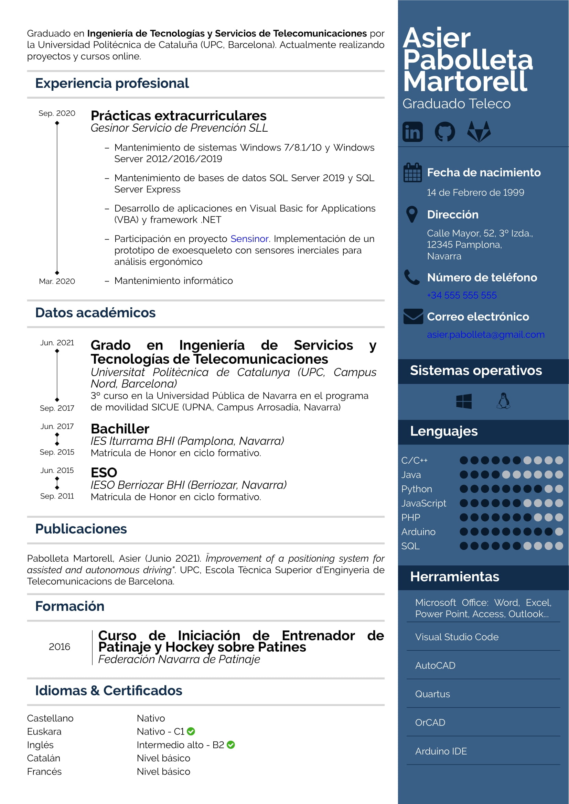
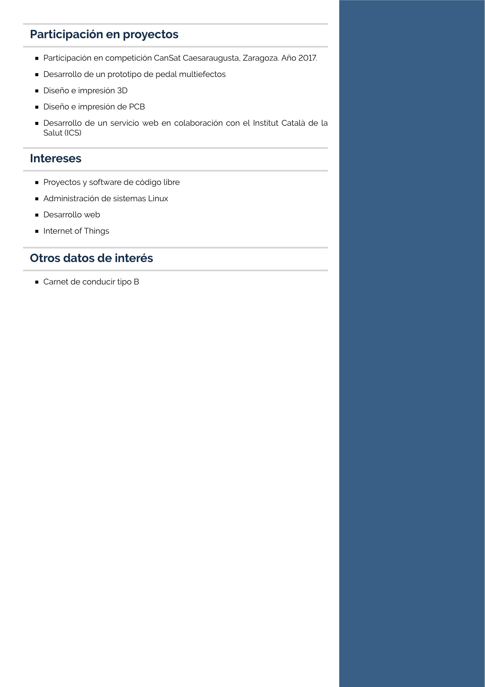

# Great CV document created with LaTeX

## What is Great CV?
Great CV is a template and a document class created with [LaTeX](https://www.latex-project.org/) for building your own *Curriculum Vitae*.

|                                    |                                    |
| ---------------------------------- | ---------------------------------- |
|  |  |

The document class definition in `greatcv.cls` contains predefined commands and environments to customize your CV document. Many color and lenght definitions are also customizable to adjust the layout and appearance to your requirements.

The `maincv.tex` file contains an example on how to create the CV based on the class definition.

## How to use Great CV?

### Requirements
A full TeX distribution is required. [TeX Live](http://tug.org/texlive/) is the recommended TeX distribution for Unix, macOS and Windows systems. Run the next command in the command line to get the last version installed (refer to the official website for concrete installation steps).

```bash
$ sudo apt install texlive-full
```

### Usage
To use the `greatcv` document class import the `greatcv.cls` file from the preamble of a TeX file (`.tex`). Edit the CV definitions and use corresponding commands to build your CV document.

```tex

% Load Great CV document class
\documentclass{greatcv}

% CV definitions
\cvname{Asier Pabolleta Martorell}
\cvdescription{Graduado Teleco}
\cvbirthday{14 de Febrero de 1999}
\cvaddress{Calle Mayor, 52, 3º Izda., \\12345 Pamplona, \\Navarra}
\cvphone{+34 555 555 555}
\cvemail{asier.pabolleta@gmail.com}
\cvlinkedin{https://www.linkedin.com/in/asier-pabolleta-martorell/}
\cvgithub{https://github.com/asierpabolleta}
\cvgitlab{https://gitlab.com/asierpabolleta}

\begin{document}

%%% MAIN CV CONTENT %%%

\begin{cvsidebar}

%%% SIDEBAR CV CONTENT %%%

\end{cvsidebar}


\end{document}

```

Build document:

```bash
$ make pdf MAIN=maincv.tex
```