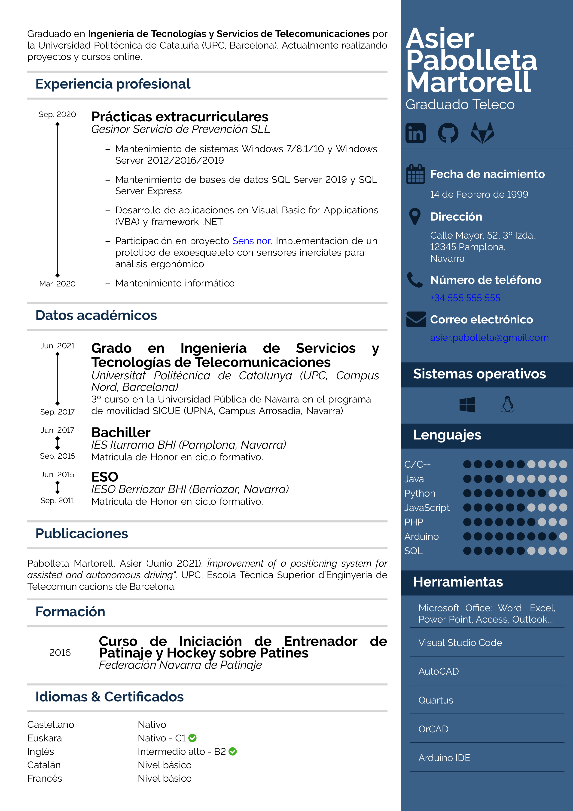
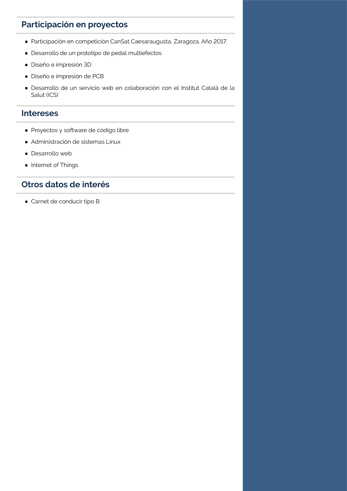

# Great CV document created with LaTeX

## What is Great CV?
Great CV is a template and a document class created with [LaTeX](https://www.latex-project.org/) for building your own *Curriculum Vitae*.

| Great CV - Page 1 | Great CV - Page 2 |
| :---:             | :---:             |
|  |  |

The document class definition in `greatcv.cls` contains predefined commands and environments to customize your CV document. Many color and lenght definitions are also customizable to adjust the layout and appearance to your requirements.

The `maincv.tex` file contains a template example to create the CV document.

## How to use Great CV?

### Requirements
A full TeX distribution is required. [TeX Live](http://tug.org/texlive/) is the recommended TeX distribution for Unix, macOS and Windows systems. Run the next command in the command line to get the last version installed.

```bash
$ sudo apt install texlive-full
```

### Options
*No options*

### Contents
The definitions contained in the file `greatcv.cls` are listed in the next subsections. Edit these values to get your custom CV.

#### CV Definitions
CV definitions are predefined attributes that contain some basic information about the user profile (name, birthday, phone, email, ...). The values are accesed by `\@attribute-name` and edited by the corresponding command with the following syntax: `\attribute-name{value}`. The CV definitions are listed below.

| Name | Description | Default value |
| ---  | ---         | ---           |
| cvname | Profile name | Profile Name |
| cvdescription | Short description | Short Description |
| cvbirthday | Date of birth | Birthday |
| cvaddress | Address | Address |
| cvphone | Phone number | Phone Number |
| cvemail | Email address | Email Address |
| cvpicture | Profile picture URL/path |
| cvlinkedin | LinkedIn profile URL |
| cvgithub | GitHub account URL |
| cvgitlab | GitLab account URL |

Additionally, some other attributes are defined.

| Name | Description | Default value |
| ---  | ---         | ---           |
| cvsidebarwidthpercentage | Width percentage of the sidebar | 0.3 |

#### Color Definitions

| Name | Description | Default value |
| ---  | ---         | ---           |
| cvmainsectiontitlecolor | Main section title color | #122E4D |
| cvmainsectionrulecolor | Main section rule color | #D5D5D5 |
| cvsidebarbackgroundcolor | Sidebar background color | #3B6088 |
| cvsidebarsectiontitlecolor | Sidebar section title color | #FFFFFF |
| cvsidebarsectionbackgroundcolor | Sidebar section background color | #122E4d |
| cvsidebartextcolor | Sidebar text color | #FFFFFF |
| cvsidebariconcolor | Sidebar icon color | #0A1B2E |
| cvbulletcolor | Bullet icon color in skill item | #0A1B2E |
| cvcheckiconcolor | Check icon color | #42B020 |

#### Lenght Definitions
Length are defined to customize the CV layout design, such as margins and paddings.

| Name | Description | Default value |
| ---  | ---         | ---           |
| cvmargin | Page margin | 1cm |
| cvmainsectiontitletopmargin | Main section title top margin | 5pt |
| cvmainsectiontitlebottommargin | Main section title bottom margin | 5pt |
| cvmainsectiontitleleftmargin | Main section title left margin | 0pt |
| cvmainsectiontitleindent | Main section title indent | 5pt |
| cvmainsectiontitlepadding | Main section title padding | 4pt |
| cvmainsectionrulethickness | Main section rule thickness | 2pt |
| cvsidebarsectiontitletopmargin | Sidebar section title top margin | 0pt |
| cvsidebarsectiontitlebottommargin | Sidebar section title bottom margin | 0pt |
| cvsidebarsectiontitleleftmargin | Sidebar section title left margin | 0pt |
| cvsidebarsectiontitlepadding | Sidebar section title padding | -5pt |
| cvsidebarsectionrulethickness | Sidebar section rule thickness | 0.5pt |

#### Icon Definitions
Some useful icons are defined.

| Name | Description | Default value |
| ---  | ---         | ---           |
| cvcheckicon | Check icon (used on certified languages/skills) |
| cvfilledicon | Filled icon used on skill item |
| cvemptyicon | Empty icon used on skill item |

#### CV Commands
CV commands are used to display formatted content on the CV document, such as timeline and skill items.

| Name   | Description |
| ---    | ---         |
| \cvmakeprofile | Makes CV profile |
| \cvitem | Creates CV item |
| \cvdateitem | Creates CV date item |
| \cvtimelineitem | Creates CV timeline item |
| \cvskill | Creates CV skill |
| \cvinfo | Creates CV info item |
| \cvlanguage | Creates CV language item |

#### Environments
Environments are used to display formatted content.

| Name   | Description |
| ---    | ---         |
| cvsidebar | Displays content in the sidebar |

### Usage
To use the `greatcv` document class import the `greatcv.cls` file from the preamble of a TeX file (`.tex`). Edit the CV definitions and use corresponding commands to build your CV document.

```tex

% Load Great CV document class
\documentclass{greatcv}

% CV definitions
\cvname{Asier Pabolleta Martorell}
\cvdescription{Graduado Teleco}
\cvbirthday{14 de Febrero de 1999}
\cvaddress{Calle Mayor, 52, 3º Izda., \\12345 Pamplona, \\Navarra}
\cvphone{+34 555 555 555}
\cvemail{asier.pabolleta@gmail.com}
\cvlinkedin{https://www.linkedin.com/in/asier-pabolleta-martorell/}
\cvgithub{https://github.com/asierpabolleta}
\cvgitlab{https://gitlab.com/asierpabolleta}

\begin{document}

%%% MAIN CV CONTENT %%%

\begin{cvsidebar}

%%% SIDEBAR CV CONTENT %%%

\end{cvsidebar}


\end{document}

```